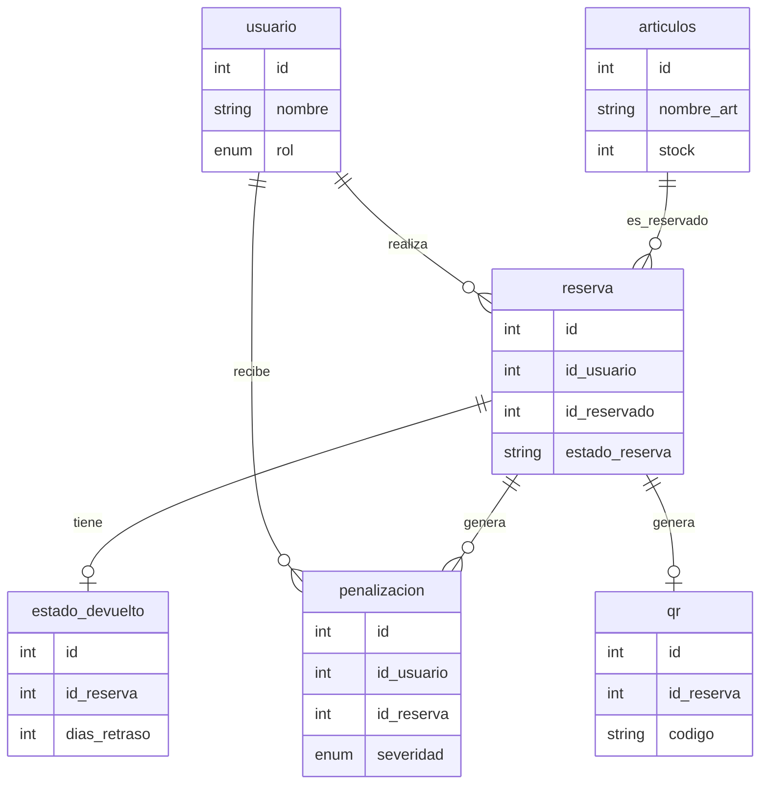

# File structure
├── app_backend
│   ├── app.py
│   ├── config.py
│   ├── database.py
│   ├── db_scripts
│   │   ├── create_seeds.sql
│   │   └── init_db.sql
│   ├── Dockerfile
│   ├── http_codes_and_messages.py
│   ├── pyproject.toml
│   ├── README.md
│   ├── routes
│   │   ├── __init__.py
│   │   ├── auth_route.py
│   │   ├── articulos_route.py
│   │   ├── reservas_route.py
│   │   ├── penalizaciones_route.py
│   │   ├── qr_route.py
│   │   ├── reportes_route.py
│   │   ├── salud_route.py
│   │   └── usuarios_routes.py
│   ├── swagger.yaml
│   ├── uv.lock
│   └── validators.py
├── app_frontend
│   ├── app.py
│   ├── config.py
│   ├── Dockerfile
│   ├── package.json
│   ├── pnpm-lock.yaml
│   ├── pyproject.toml
│   ├── README.md
│   ├── routes
│   │   ├── __init__.py
│   │   ├── admin_routes.py
│   │   ├── alumno_routes.py
│   │   ├── profesor_routes.py
│   │   └── public_routes.py
│   ├── servicios
│   ├── static
│   │   ├── css
│   │   │   └── style.css
│   │   ├── images
│   │   │   ├── favicon.png
│   │   │   ├── large_Galeria_PC_06_931d95ba80.jpg
│   │   │   ├── logo-fiuba.png
│   │   │   ├── logo_FIUBA_bco_e004995ae8.png
│   │   │   └── photo-1524995997946-a1c2e315a42f.avif
│   │   └── js
│   │       └── main.js
│   ├── templates
│   │   ├── admin
│   │   │   ├── articulos.html
│   │   │   ├── dashboard.html
│   │   │   └── reserva_detalle.html
│   │   ├── alumno
│   │   │   ├── comprobante.html
│   │   │   ├── historial.html
│   │   │   └── perfil.html
│   │   ├── layouts
│   │   │   ├── base.html
│   │   │   └── base_dashboard.html
│   │   ├── profesor
│   │   │   ├── dashboard.html
│   │   │   └── mis-reservas
│   │   │       └── nueva.html
│   │   └── public
│   │       ├── index.html
│   │       ├── logout.html
│   │       ├── normas.html
│   │       └── registro.html
│   └── uv.lock
├── docker-compose.yaml
├── init.sh
├── README.md
└── template.env

# DB schema

This database schema is designed for a library or equipment management system. It follows a relational structure focused on tracking usuarios, the articulos available for reserva, the transactions (reservations), and the subsequent management of returns and potential penalizaciones.

### Database Schema Description

* **`usuario`**: The core entity representing any person interacting with the system. It uses an `ENUM` to define access levels (`rol`) and includes authentication fields (`contrasenia_hash`) and status tracking (`activo`).
* **`articulos`**: Stores the inventory. It tracks articulo categorization (`tipo`, `seccion`) and availability (`stock`, `necesita_reparacion`).
* **`reserva`**: The central transactional table connecting `usuario` and `articulos`. It manages the timeline of the reserva (`fecha_retiro`, `fecha_regreso`).
* **`estado_devuelto`**: A child table of `reserva` that records the quality of return, specifically noting `dias_retraso` for potential enforcement.
* **`penalizacion`**: Linked to both `usuario` and `reserva`. It tracks disciplinary actions taken against usuarios, including the duration and severidad of the sanction.
* **`qr`**: A utility table for verifying transactions. Each reservation generates a unique code that can be flagged as `escaneado` upon exitoful pickup or return.
* **`normativa`**: An independent table used to store institutional policies or rules, serving as reference material for the system.

---

### Entity-Relationship Representation

The following diagram illustrates the logical flow and relational dependencies of your schema:

### Technical Observations

* **Normalization**: The schema is well-normalized for a relational system, effectively decoupling the transactional record (`reserva`) from supplementary data like returns or penalizaciones.
* **Extensibility**: The inclusion of a `normativa` table suggests that the system expects dynamic updates to rules.
* **Constraints**: You are using appropriate foreign key constraints to ensure referential integrity, preventing orphans in the `reserva` or `penalizacion` tables.

# Endpoints

This API provides a centralized system for managing inventory, reservas, penalizaciones, and usuario administration. Below is a structured summary of the endpoints.

### 1. Authentication

Handles usuario sessions.

* **`POST /auth/login`**: Authenticates usuario credentials and establishes a session.
* *Payload:* `LoginRequest` (usuarioname, contrasenia)

* **`POST /auth/logout`**: Closes the active session.
* **`GET /auth/me`**: Retrieves the current usuario's profile and rol.

---

### 2. Users

Management of registered usuarios.

* **`GET /usuarios`**: Lists all usuarios (Admin).
* **`POST /usuarios`**: Creates a new usuario (Admin).
* *Payload:* `UserCreate`

* **`GET /usuarios/{id}`**: Gets details of a specific usuario.
* **`PUT /usuarios/{id}`**: Updates complete usuario profile (Admin).
* *Payload:* `UserUpdate`

* **`DELETE /usuarios/{id}`**: Performs a logical deletion (deactivation) of a usuario.
* **`PATCH /usuarios/{id}/status`**: Partially updates only the active status.
* *Payload:* `UserStatusUpdate`

* **`GET /usuarios/{id}/reservas`**: Fetches the personal reserva history for a usuario.
* **`GET /usuarios/{id}/penalizaciones`**: Fetches the penalty history for a usuario.

---

### 3. Inventory & Materials

Manages catalog and articulo stock.

* **`GET /articulos`**: Retrieves articulo catalog. Supports query filters: `category`, `condition`, `available`.
* **`POST /articulos`**: Adds a new articulo to inventory (Admin).
* *Payload:* `ItemCreate`

* **`GET /articulos/{id}`**: Detailed view of a specific articulo.
* **`PUT /articulos/{id}`**: Updates full articulo information (Admin).
* *Payload:* `ItemUpdate`

* **`DELETE /articulos/{id}`**: Deletes an articulo from inventory (Admin).
* **`PATCH /articulos/{id}/condition`**: Updates the physical condition/repair status of an articulo.
* *Payload:* `ItemConditionUpdate`

---

### 4. Loans & Reservations

Manages the reserva lifecycle.

* **`GET /reservas`**: Lists reservas. Admins see all, usuarios see their own. Supports filters: `status`, `startDate`, `endDate`.
* **`POST /reservas`**: Creates a new reservation request.
* *Payload:* `LoanCreate`

* **`GET /reservas/{id}`**: Gets full details of a specific reserva.
* **`PATCH /reservas/{id}/status`**: Updates the reservation state (Admin).
* *Payload:* `LoanStatusUpdate`

---

### 5. QR Codes

* **`GET /qr/reservas/{reserva_id}`**: Generates or retrieves the dynamic QR code for an approved reserva.

---

### 6. Penalties

Management of disciplinary records.

* **`GET /penalizaciones`**: Lists all penalizaciones (Admin).
* **`POST /penalizaciones`**: Manually creates a penalty (Admin).
* *Payload:* `PenaltyCreate`

* **`GET /penalizaciones/{id}`**: Gets details of a specific penalty.
* **`PUT /penalizaciones/{id}`**: Replaces the full penalty record.
* *Payload:* `PenaltyUpdate`

* **`PATCH /penalizaciones/{id}`**: Partially updates severidad, notes, or resolution status.
* *Payload:* `PenaltyPatchUpdate`

---

### 7. Reports & Statistics

* **`GET /reports`**: Generates reports (Admin). Required query param: `type` (dashboard, demand, overdue, history, inventory). Optional param: `format` (json, pdf).

---

### 8. System Health

* **`GET /ping`**: Simple heartbeat check to ensure the backend is operational.

---
